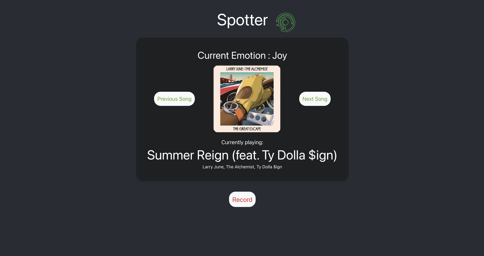

# Spotter
This project is the final project for my CNIT 48300: Applied Machine Learning class. The project that I have decided to work on is called Spotter, an artificial intelligent Machine Learning Spotify helper that plays a song based on how the user feels.

In this project I have decided to use pytorch as the machine learning framework of choice as I was more familiar with it. With Spotter (Spotify Helper), what you can do is that you can speak to Spotter, and say something that has happened/ how you are feeling, and then spotter would play you a song based on what it interpretes your emotions to be.

Spotter can classify up to 5 emotions: Joy, Sadness, Fear, Surprise, Anger.

This is a NLP (Natural Language Processing) based project, I took inspiration from the RNNs that we learnt in class and have decided to play with RNNs in pytorch. Specifically, I have chose to use LSTM, which is a form of RNN, as the model of choice as I have seen promising results from other projects that conducted sentiment analysis on textual input data.

There are 3 main components for this project:
The user facing “Spotter” which listens to the users microphone and does a speech-to-text transformation.
The model itself that was trained to analyze the emotion of the text that was inputted by our previous component.
Our “Spotify Helper”, which is a python Spotify SDK that I have found called Spotipy, which makes RESTFul api calls to the Spotify developer endpoints to retrieve information regarding the songs in their playlist, play/pause songs etc…

Do note that to run this project you would need to provide a Spotify Client ID and Spotify Client Secret, details to this could be found here.

## Image of Spotter web application
